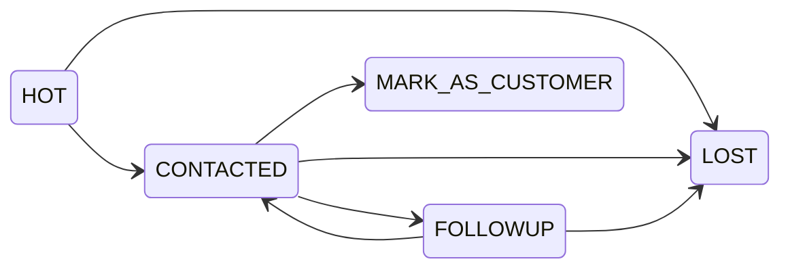

# Frontend Complete Integration Guide: Leads Management (V2)

This document provides complete instructions for integrating the Leads feature (Module 4) on the frontend. It covers both the **Distributor** and **Super Admin** implementations, detailing endpoint structures, paginations, searching, funnel progress integration, strict status transitions, and error handling.

## Table of Contents
1. [How Leads Work (Overview)](#1-how-leads-work-overview)
2. [Distributor Side APIs](#2-distributor-side-apis)
3. [Super Admin Side APIs](#3-super-admin-side-apis)
4. [UI Implementation Guide](#4-ui-implementation-guide)
5. [Error Handling](#5-error-handling)
6. [Implementation Checklist](#6-implementation-checklist)

---

## 1. How Leads Work (Overview)

### Lead Lifecycle
A Lead is created in the system immediately when a newly registered user completes their profile setup (e.g., provides their country and their status becomes `ACTIVE`). It links the newly registered user to the distributor whose referral link they used.

If no distributor is linked in `UserAcquisition`, the system will automatically fall back and assign the lead to the first system `SUPER_ADMIN`.

### Automatic vs. Manual Status Changes
- **Automatic Transitions (Funnel Driven):**
  - **NEW → WARM**: When the lead verifies their phone number at the Phone Gate step.
  - **(ANY) → HOT**: When the lead selects "YES" at the Decision step.
  - **(ANY) → NURTURE**: When the lead selects "NO" at the Decision step (enrolls in day 1/3/7 email drip).
  - **MARK_AS_CUSTOMER**: The application automatically elevates a Lead's `UserRole` to `CUSTOMER` when the distributor manually sets their status to `MARK_AS_CUSTOMER`.
- **Manual Transitions (Distributor/Admin Driven):**
  - Distributors manage leads by manually shifting the status down the pipeline.
  - For Distributors, transitioning a status manually requires adhering to strict transition rules (see UI Implementation). 

### Complete Status Map

| Backend Enum Status | Meaning / Pipeline Location                                |
|---------------------|------------------------------------------------------------|
| `NEW`               | Default state on lead creation.                            |
| `WARM`              | Lead verified their phone number.                          |
| `HOT`               | Lead expressed active interest (Decision YES).             |
| `CONTACTED`         | Manual state. Distributor has engaged the lead.            |
| `FOLLOWUP`          | Manual state. Scheduled for a future contact date.         |
| `NURTURE`           | Auto state. Dropped into the email drip sequence (Decision NO). |
| `LOST`              | Manual state. Not interested/Disqualified.                 |
| `MARK_AS_CUSTOMER`  | Manual state. Finalizing conversion (Changes global user role).|

### Status Badge Colors

| Status | Badge Color |
|--------|-------------|
| `NEW` | slate |
| `WARM` | yellow |
| `HOT` | amber |
| `CONTACTED` | blue |
| `FOLLOWUP` | orange |
| `MARK_AS_CUSTOMER` | green |
| `LOST` | gray |
| `NURTURE` | purple |

> [!NOTE]
> Backend queries now return the Lead's `country`, allowing regional alignment in the UI immediately on the main dashboard screens.

---

## 2. Distributor Side APIs

All endpoints require JWT authorization and the `'DISTRIBUTOR'` role. Only leads explicitly assigned to the calling distributor are returned.

### `GET /api/v1/leads`
Retrieves a paginated list of leads assigned to the authenticated distributor.

**Query Parameters:**
- `page` (number, default: 1): The page to fetch.
- `limit` (number, default: 20): The amount of leads per page.
- `status` (string, optional): Filter by `LeadStatus`.
- `search` (string, optional): Searches on User Full Name, User Email, or Phone asynchronously.

**Response Structure:**
```json
{
  "items": [
    {
      "uuid": "dc1ea440-...",
      "userUuid": "...",
      "assignedToUuid": "...",
      "distributorUuid": "...",
      "status": "HOT",
      "phone": "+1234567890",
      "createdAt": "2026-04-01T12:00:00Z",
      "updatedAt": "2026-04-01T12:00:00Z",
      "user": {
        "uuid": "...",
        "fullName": "Jane Doe",
        "email": "jane@example.com",
        "country": "US"
      }
    }
  ],
  "total": 45,
  "page": 1,
  "limit": 20,
  "totalPages": 3
}
```

### `GET /api/v1/leads/:uuid`
Fetches the detailed view for a single lead, including their entire activity history and their real-time funnel progress.

**Response Structure:**
```json
{
  "uuid": "dc1ea440-...",
  "status": "HOT",
  "phone": "+1234567890",
  "user": { 
    "uuid": "...", 
    "fullName": "Jane Doe", 
    "email": "jane@example.com",
    "country": "US"
  },
  "activities": [
    {
      "uuid": "...",
      "action": "STATUS_CHANGE",
      "fromStatus": "NEW",
      "toStatus": "WARM",
      "notes": "Phone number verified",
      "createdAt": "2026-04-01T12:05:00Z",
      "actor": { "uuid": "...", "fullName": "System" }
    }
  ],
  "funnelProgress": {
    "phoneVerified": true,
    "paymentCompleted": true,
    "decisionAnswer": "YES",
    "completedSteps": 3,
    "currentStepUuid": "step-uuid-1234"
  }
}
```

### `PATCH /api/v1/leads/:uuid/status`
Updates the status of a specific lead. Extremely strict business transition rules apply to Distributors.

**Request Body:**
```json
{
  "status": "FOLLOWUP",
  "notes": "Spoke on phone, call back next Tuesday.",
  "followupAt": "2026-04-10T15:00:00Z"
}
```

**Distributor Transition Rules (Crucial for UI):**
- `HOT` → `CONTACTED`, `LOST`
- `CONTACTED` → `FOLLOWUP`, `MARK_AS_CUSTOMER`, `LOST`
- `FOLLOWUP` → `CONTACTED`, `LOST`
- *(Distributors cannot transition manually out of NEW, WARM, NURTURE, LOST, or MARK_AS_CUSTOMER)*

**Business Rules:**
- If status is `FOLLOWUP`, **`notes` are strictly required (must not be empty/whitespace).**
- If status is `FOLLOWUP`, **`followupAt` is strictly required and must be a future ISO date.**

### `GET /api/v1/leads/followups/today`
Returns a dedicated array of leads whose `followupAt` timestamp falls within the bounds of "today".
*(Response returns standard array of Leads, no pagination).*

**Response Structure:**
```json
[
  {
    "uuid": "dc1ea440-...",
    "userUuid": "...",
    "assignedToUuid": "...",
    "distributorUuid": null,
    "status": "FOLLOWUP",
    "phone": "+1234567890",
    "createdAt": "2026-04-01T12:00:00Z",
    "updatedAt": "2026-04-02T08:00:00Z",
    "user": {
      "uuid": "...",
      "fullName": "Jane Doe",
      "email": "jane@example.com",
      "country": "US"
    },
    "activities": [
      {
        "uuid": "...",
        "action": "FOLLOWUP_SCHEDULED",
        "fromStatus": "CONTACTED",
        "toStatus": "FOLLOWUP",
        "notes": "Call back tomorrow",
        "followupAt": "2026-04-02T14:00:00Z",
        "createdAt": "2026-04-01T16:00:00Z",
        "actor": {
          "uuid": "...",
          "fullName": "Distributor Name"
        }
      }
    ]
  }
]
```

---

## 3. Super Admin Side APIs

All endpoints require JWT authorization and the `'SUPER_ADMIN'` role.

### `GET /api/v1/admin/leads`
Fetches all leads system-wide with modern pagination and search filtering.

**Query Parameters:**
- `page` (default: 1)
- `limit` (default: 20)
- `status` (string, optional)
- `search` (string, optional)

**Response Structure**:
Exact same `{ items, total, page, limit, totalPages }` wrapper as the Distributor side, but each Lead block also includes:
```json
"assignedTo": {
  "uuid": "...",
  "fullName": "Master Distributor"
}
```

### `GET /api/v1/admin/leads/:uuid`
System-wide single lead detail. Matches the Distributor view visually but includes overarching administration context.
- Included relations: `user`, `assignedTo`, `distributor`, `activities`, and the `nurtureEnrollment` payload.
- Also perfectly integrates `funnelProgress`.

### `PATCH /api/v1/admin/leads/:uuid/status`
Allows Super Admins to manually bypass the restrictive distributor transitions. Super Admins can move any Lead to any Status.
- **Still Requires:** `notes` and `followupAt` when `status` === `FOLLOWUP`.

### `GET /api/v1/admin/leads/distributor/:distributorUuid`
Fetches all leads currently assigned to a single distributor. *(Returns unpaginated array for table viewing).*

### `GET /api/v1/admin/leads/followups/today`
Global metric fetch. Returns an unpaginated array of all system-wide followups due today.

**Response Structure:**
```json
[
  {
    "uuid": "dc1ea440-...",
    "userUuid": "...",
    "assignedToUuid": "...",
    "distributorUuid": null,
    "status": "FOLLOWUP",
    "phone": "+1234567890",
    "createdAt": "2026-04-01T12:00:00Z",
    "updatedAt": "2026-04-02T08:00:00Z",
    "assignedTo": {
      "uuid": "...",
      "fullName": "Master Distributor"
    },
    "user": {
      "uuid": "...",
      "fullName": "Jane Doe",
      "email": "jane@example.com",
      "country": "US"
    },
    "activities": [
      {
        "uuid": "...",
        "action": "FOLLOWUP_SCHEDULED",
        "fromStatus": "CONTACTED",
        "toStatus": "FOLLOWUP",
        "notes": "Call back tomorrow",
        "followupAt": "2026-04-02T14:00:00Z",
        "createdAt": "2026-04-01T16:00:00Z",
        "actor": {
          "uuid": "...",
          "fullName": "Distributor Name"
        }
      }
    ]
  }
]
```

---

## 4. UI Implementation Guide

### Leads List Page (Distributor & Admin)
- Implement a Data Grid or Table.
- **Columns:** Name, Email, Phone, Country, Status, Created Date.
- **Controls:** Connect a text input to the `?search=` parameter (debounce typing by ~300ms).
- **Pagination:** Utilize `{ page, totalPages, total }` to power page numbers at the bottom of the table. Connect back/next buttons to `?page=N`.

### Status Dropdown Component
Do **not** show the raw Enum strings to the user. Present them cleanly (`"MARK_AS_CUSTOMER"` -> `"Convert to Customer"`).
- **Smart Disabling**: Check the lead's current status and disable transition options based on `ALLOWED_TRANSITIONS`. 
- **Mermaid Diagram (Allowed Distributor Transitions):**


### The FOLLOWUP Modal
When a user selects the `FOLLOWUP` status from a dropdown:
1. Immediately intercept the API call and open a Modal dialogue box.
2. Require a Date/Time Component (Output to ISO-8601 string). Ensure it blocks past dates in the UI calendar.
3. Require a Notes Textarea. Disable the submit button until `notes.trim().length > 0`.
4. Fire the `PATCH` payload with `status`, `notes`, and `followupAt`.

### Lead Detail Page (Funnel Progress Integration)
On the detailed view, construct a "Visual Funnel Progress" component using the `funnelProgress` object.
- **Phone:** Green check mark if `phoneVerified` is true.
- **Payments:** Green check mark if `paymentCompleted` is true.
- **Videos:** Display a progress bar based on `completedSteps` vs Total Steps in your funnel. 
- **Interest:** Show `decisionAnswer` as a pronounced badge ('YES' or 'NO').

### Today's Followup Banner
On the main Distributor and Admin dashboards, fire the `/followups/today` endpoint. If the array length > 0, display a floating notification or top-anchored banner alerting the user: *"You have X leads to follow up on today!"*

---

## 5. Error Handling

Listen for standard NestJS HTTP status envelopes on errors.

| Code | Triggered On | Resolution For Frontend |
|------|-------------|-------------------------|
| `400` | `'Cannot transition from X to Y'` | Sync UI disable-states with the backend transition rules map. |
| `400` | `'Notes are required when scheduling a followup'` | Ensure the POST/PATCH block requires text area input before un-locking submission. |
| `400` | `'followupAt is required when status is FOLLOWUP'` | Verify Date Picker is initialized and correctly firing a valid future date structure. |
| `400` | `'followupAt must be in the future'` | Verify the clock sync / timezone shift didn't trigger a past-bound ISO string. Use `Date.now() + buffer`. |
| `401` | Unauthorized | Redirect to login. Expired JWT. |
| `403` | Forbidden | Attempted to touch a lead assigned to a different distributor. Show a "Permission Denied" alert. |
| `404` | Lead Not Found | Safely drop back to the Leads List Page (`/leads`). |

---

## 6. Complete Implementation Checklist

### Distributor Checklist
- [ ] Connect `GET /leads` using page/limit defaults (`?page=1&limit=20`) and read the `items` array.
- [ ] Implement search bar passing `?search=XYZ`.
- [ ] Render the country flag/UI next to the user name securely.
- [ ] Create strict Dropdown state for `PATCH /leads/:uuid/status` (obeying Hot -> Contacted -> Followup logic).
- [ ] Build the "FOLLOWUP Modal" requiring notes & strict future dates.
- [ ] Render the individual `/leads/uuid` Detail page focusing on the `funnelProgress` state tracking.
- [ ] Integrate the "Today's Followups" visual banner.

### Admin Checklist
- [ ] Connect global `GET /admin/leads` to the overarching Admin Data Table.
- [ ] Ensure pagination states map properly to global totals vs limit splits.
- [ ] Support bypassing dropdown lock-outs (Admins can toggle any status manually).
- [ ] Use `GET /admin/leads/distributor/:uuid` to render Leads visually housed inside a specific Distributor's detail page.

### Notes for Mihir
- Server-side pagination is now live. Be sure the existing frontend array `v-for` or `.map()` loops now cleanly target `response.data.items` instead of just `response.data`.
- Since we now embed the nested `funnelProgress` query behind the scenes instead of needing dual HTTP round-trips, Lead detail rendering times on the frontend should noticeably improve.
