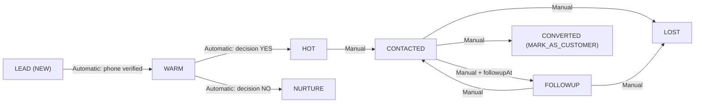

# Leads Frontend Integration Guide

This guide documents the frontend contract for the leads module as it exists in the backend today.

It was prepared by reading:

- `src/leads/leads.controller.ts`
- `src/leads/leads-admin.controller.ts`
- `src/leads/leads.service.ts`
- `src/leads/dto/update-lead-status.dto.ts`
- `prisma/schema.prisma` (`Lead`, `LeadActivity`, `NurtureEnrollment`, `LeadStatus`, `LeadAction`)

Examples below use the local development base URL:

```txt
http://localhost:3000/api/v1
```

> Important terminology note: the backend status enum uses `NEW` and `MARK_AS_CUSTOMER`. If product/UI language says `LEAD` and `CONVERTED`, the frontend should map them like this:
>
> - `LEAD` in UI = backend `NEW`
> - `CONVERTED` in UI = backend `MARK_AS_CUSTOMER`

> Important API contract note: the current leads endpoints do not implement server pagination, and they do not enforce a strict status-transition graph beyond `FOLLOWUP` date validation. If you want a narrower business flow, the frontend must enforce it in the UI.

## Table of Contents

- [1. How Leads Work (Overview)](#1-how-leads-work-overview)
- [2. Distributor Side APIs](#2-distributor-side-apis)
- [2.1 View My Leads](#21-view-my-leads)
- [2.2 View Single Lead](#22-view-single-lead)
- [2.3 Update Lead Status](#23-update-lead-status)
- [2.4 Today's Followups](#24-todays-followups)
- [3. Super Admin Side APIs](#3-super-admin-side-apis)
- [3.1 View All Leads (Admin)](#31-view-all-leads-admin)
- [3.2 View Single Lead (Admin)](#32-view-single-lead-admin)
- [3.3 Update Lead Status (Admin)](#33-update-lead-status-admin)
- [3.4 Distributor Leads](#34-distributor-leads)
- [3.5 Today's Followups (Admin)](#35-todays-followups-admin)
- [4. UI Implementation Guide](#4-ui-implementation-guide)
- [4.1 Leads List Page](#41-leads-list-page)
- [4.2 Lead Status Dropdown](#42-lead-status-dropdown)
- [4.3 Lead Detail / Profile Page](#43-lead-detail--profile-page)
- [4.4 Today's Followup Banner](#44-todays-followup-banner)
- [4.5 Status Flow Diagram](#45-status-flow-diagram)
- [5. Error Handling](#5-error-handling)
- [6. Complete Implementation Checklist](#6-complete-implementation-checklist)

## 1. How Leads Work (Overview)

### Lead lifecycle in simple terms

The backend creates one lead per user.

- A lead is created when the user completes profile setup and becomes `ACTIVE`.
- The lead starts in backend status `NEW`.
- After phone verification, the lead becomes `WARM`.
- If the user answers `YES` on the funnel decision step, the lead becomes `HOT`.
- If the user answers `NO`, the lead becomes `NURTURE` and a nurture enrollment record is created.
- After that, admins or distributors can manually update the lead through the leads APIs.

### Status map

| UI/Product label | Backend enum | How it happens |
| --- | --- | --- |
| `LEAD` | `NEW` | Automatic when profile is completed |
| `WARM` | `WARM` | Automatic when phone is verified |
| `HOT` | `HOT` | Automatic when user chooses `YES` at funnel decision |
| `CONTACTED` | `CONTACTED` | Manual update by admin or assigned distributor |
| `FOLLOWUP` | `FOLLOWUP` | Manual update with future `followupAt` |
| `CONVERTED` | `MARK_AS_CUSTOMER` | Manual update by admin or assigned distributor |
| `LOST` | `LOST` | Manual update by admin or assigned distributor |
| `NURTURE` | `NURTURE` | Automatic when user chooses `NO` at funnel decision |

### When a lead is created

Lead creation is handled by `LeadsService.createLeadForUser(userUuid)`.

What that method does:

1. Checks whether the user already has a lead.
2. Looks up acquisition/referral data.
3. Assigns the lead:
   - to the referred distributor when `user_acquisitions.distributorUuid` exists
   - otherwise to the first `SUPER_ADMIN` in the database
4. Copies the user's phone if it already exists on the profile.
5. Creates the lead with status `NEW`.

### Automatic status changes

| Trigger | Backend method | Status change | Extra side effects |
| --- | --- | --- | --- |
| Profile completion | `createLeadForUser` | none beyond creation in `NEW` | lead assigned to distributor or first super admin |
| Phone verified | `onPhoneVerified` | `NEW -> WARM` | phone copied from `user_profiles.phone`; `LeadActivity` row created |
| Decision = YES | `onDecisionYes` | any current status -> `HOT` | `LeadActivity` row created |
| Decision = NO | `onDecisionNo` | any current status -> `NURTURE` | `NurtureEnrollment` created if missing; `nextEmailAt` set to about 24 hours later; `LeadActivity` row created |

### Manual status changes

The following endpoints support manual updates:

- Distributor: `PATCH /api/v1/leads/:uuid/status`
- Super admin: `PATCH /api/v1/admin/leads/:uuid/status`

Manual updates write:

- the new `Lead.status`
- a `LeadActivity` log row
- `LeadAction.FOLLOWUP_SCHEDULED` when status is `FOLLOWUP`
- `LeadAction.STATUS_CHANGE` for all other status changes

If the new status is `MARK_AS_CUSTOMER`, the backend also updates:

- `User.role = CUSTOMER`

### What happens when user says NO

When the user answers `NO` at the funnel decision step:

1. The lead status becomes `NURTURE`.
2. The backend creates a `nurture_enrollments` row if one does not already exist.
3. `nextEmailAt` is set to approximately 24 hours in the future.
4. A `LeadActivity` row is created with a note about nurture enrollment.

### Prisma model shapes that matter to frontend

#### Lead model

| Field | Type | Meaning |
| --- | --- | --- |
| `uuid` | `string` | Lead ID |
| `userUuid` | `string` | Linked user ID |
| `assignedToUuid` | `string` | Current owner of the lead queue |
| `distributorUuid` | `string \| null` | Referring distributor, if any |
| `status` | `LeadStatus` | Current lead status |
| `phone` | `string \| null` | Copied from verified profile phone |
| `createdAt` | `string` | Creation timestamp |
| `updatedAt` | `string` | Last update timestamp |

#### LeadActivity model

| Field | Type | Meaning |
| --- | --- | --- |
| `uuid` | `string` | Activity ID |
| `leadUuid` | `string` | Parent lead ID |
| `actorUuid` | `string` | User/admin/distributor who triggered the change |
| `fromStatus` | `LeadStatus \| null` | Previous status |
| `toStatus` | `LeadStatus \| null` | New status |
| `action` | `LeadAction` | `STATUS_CHANGE`, `NOTE`, or `FOLLOWUP_SCHEDULED` |
| `notes` | `string \| null` | Optional note |
| `followupAt` | `string \| null` | Scheduled followup date for followup actions |
| `createdAt` | `string` | When the activity was logged |

#### NurtureEnrollment model

| Field | Type | Meaning |
| --- | --- | --- |
| `uuid` | `string` | Nurture enrollment ID |
| `userUuid` | `string` | User ID |
| `leadUuid` | `string` | Lead ID |
| `status` | `ACTIVE \| COMPLETED \| UNSUBSCRIBED` | Current nurture status |
| `day1SentAt` | `string \| null` | Day 1 email sent time |
| `day3SentAt` | `string \| null` | Day 3 email sent time |
| `day7SentAt` | `string \| null` | Day 7 email sent time |
| `nextEmailAt` | `string \| null` | Next nurture email due time |
| `createdAt` | `string` | Created timestamp |
| `updatedAt` | `string` | Updated timestamp |

## 2. Distributor Side APIs

All distributor routes are protected by:

- `JwtAuthGuard`
- `RolesGuard`
- `@Roles('DISTRIBUTOR')`

Required header for protected calls:

```http
Authorization: Bearer <accessToken>
```

> Distributors can only read or update leads where `assignedToUuid === current distributor UUID`.

### 2.1 View My Leads

Endpoint:

```http
GET /api/v1/leads
```

Full example request:

```http
GET http://localhost:3000/api/v1/leads?status=HOT
Authorization: Bearer <accessToken>
```

#### Query params

| Query param | Supported today | Notes |
| --- | --- | --- |
| `status` | Yes | Must be a backend status enum such as `HOT`, `CONTACTED`, `FOLLOWUP`, `NURTURE`, `LOST`, `MARK_AS_CUSTOMER` |
| `page` | No | Not implemented by controller/service |
| `limit` | No | Not implemented by controller/service |

Response shape:

```json
[
  {
    "uuid": "de3f7c5c-2f61-46be-bd25-6f1c2b2fc595",
    "userUuid": "8b87ec76-8837-406b-b11e-e57ce84e685f",
    "assignedToUuid": "b4456d50-a1e0-4e89-96bf-c9169e4a1e2b",
    "distributorUuid": "b4456d50-a1e0-4e89-96bf-c9169e4a1e2b",
    "status": "HOT",
    "phone": "+919999999999",
    "createdAt": "2026-04-02T08:20:00.000Z",
    "updatedAt": "2026-04-02T10:12:00.000Z",
    "user": {
      "uuid": "8b87ec76-8837-406b-b11e-e57ce84e685f",
      "fullName": "Aarav Mehta",
      "email": "aarav@example.com"
    }
  },
  {
    "uuid": "6d731a1f-8c28-4994-96d9-2f92cf94bd14",
    "userUuid": "67254bb0-7446-4ae7-80a4-f4d88c9d98e4",
    "assignedToUuid": "b4456d50-a1e0-4e89-96bf-c9169e4a1e2b",
    "distributorUuid": null,
    "status": "FOLLOWUP",
    "phone": "+918888888888",
    "createdAt": "2026-04-01T11:00:00.000Z",
    "updatedAt": "2026-04-02T07:30:00.000Z",
    "user": {
      "uuid": "67254bb0-7446-4ae7-80a4-f4d88c9d98e4",
      "fullName": "Maya Singh",
      "email": "maya@example.com"
    }
  }
]
```

#### Response field notes

| Field | Meaning |
| --- | --- |
| `assignedToUuid` | The distributor who owns this lead queue entry |
| `distributorUuid` | The referring distributor, if the lead came through a distributor referral |
| `user.fullName` | Best source for lead display name |
| `user.email` | Best source for lead email |
| `phone` | Verified phone copied onto the lead record |

#### Important notes and business rules

- Results are ordered by `updatedAt desc`.
- The endpoint returns a raw array, not `{ items, total, page }`.
- If `status` is omitted, the distributor gets all of their assigned leads.
- There is no server-side search on this endpoint.

#### How to show leads list in UI

- Build the list from the returned array.
- Show status badges from `status`.
- Show source as:
  - `Distributor` when `distributorUuid` is not null
  - `Direct` when `distributorUuid` is null
- For pagination, use client-side pagination because backend pagination is not implemented here.

### 2.2 View Single Lead

Endpoint:

```http
GET /api/v1/leads/:uuid
```

Full example request:

```http
GET http://localhost:3000/api/v1/leads/de3f7c5c-2f61-46be-bd25-6f1c2b2fc595
Authorization: Bearer <accessToken>
```

Response shape:

```json
{
  "uuid": "de3f7c5c-2f61-46be-bd25-6f1c2b2fc595",
  "userUuid": "8b87ec76-8837-406b-b11e-e57ce84e685f",
  "assignedToUuid": "b4456d50-a1e0-4e89-96bf-c9169e4a1e2b",
  "distributorUuid": "b4456d50-a1e0-4e89-96bf-c9169e4a1e2b",
  "status": "HOT",
  "phone": "+919999999999",
  "createdAt": "2026-04-02T08:20:00.000Z",
  "updatedAt": "2026-04-02T10:12:00.000Z",
  "user": {
    "uuid": "8b87ec76-8837-406b-b11e-e57ce84e685f",
    "fullName": "Aarav Mehta",
    "email": "aarav@example.com"
  },
  "activities": [
    {
      "uuid": "505fd35c-7a96-4a4d-babd-509ce00f6291",
      "leadUuid": "de3f7c5c-2f61-46be-bd25-6f1c2b2fc595",
      "actorUuid": "8b87ec76-8837-406b-b11e-e57ce84e685f",
      "fromStatus": "WARM",
      "toStatus": "HOT",
      "action": "STATUS_CHANGE",
      "notes": "User selected YES at decision step",
      "followupAt": null,
      "createdAt": "2026-04-02T10:10:00.000Z",
      "actor": {
        "uuid": "8b87ec76-8837-406b-b11e-e57ce84e685f",
        "fullName": "Aarav Mehta"
      }
    }
  ]
}
```

#### What fields to show on the lead detail page

- Name: `user.fullName`
- Email: `user.email`
- Phone: `phone`
- Current status: `status`
- Source:
  - `Distributor` if `distributorUuid` exists
  - `Direct` otherwise
- Created date: `createdAt`
- Last updated date: `updatedAt`
- Timeline/history: `activities`

#### Important notes and business rules

- If the lead does not belong to the current distributor, the backend returns `403 Access denied`.
- Distributor detail does not include `assignedTo`, `distributor`, or `nurtureEnrollment`.
- Activities are ordered by `createdAt desc`.

### 2.3 Update Lead Status

Endpoint:

```http
PATCH /api/v1/leads/:uuid/status
```

Full example request:

```http
PATCH http://localhost:3000/api/v1/leads/de3f7c5c-2f61-46be-bd25-6f1c2b2fc595/status
Authorization: Bearer <accessToken>
Content-Type: application/json
```

#### Mark as CONTACTED

```json
{
  "status": "CONTACTED",
  "notes": "Called the lead and introduced the product."
}
```

#### Mark as FOLLOWUP

```json
{
  "status": "FOLLOWUP",
  "followupAt": "2026-04-05T11:00:00.000Z",
  "notes": "Asked to call again after salary credit."
}
```

#### Mark as CONVERTED

> Backend API value is `MARK_AS_CUSTOMER`, even if the UI label is `Converted`.

```json
{
  "status": "MARK_AS_CUSTOMER",
  "notes": "Customer completed purchase offline."
}
```

#### Mark as LOST

```json
{
  "status": "LOST",
  "notes": "Not interested after followup."
}
```

Response shape:

```json
{
  "uuid": "de3f7c5c-2f61-46be-bd25-6f1c2b2fc595",
  "userUuid": "8b87ec76-8837-406b-b11e-e57ce84e685f",
  "assignedToUuid": "b4456d50-a1e0-4e89-96bf-c9169e4a1e2b",
  "distributorUuid": "b4456d50-a1e0-4e89-96bf-c9169e4a1e2b",
  "status": "FOLLOWUP",
  "phone": "+919999999999",
  "createdAt": "2026-04-02T08:20:00.000Z",
  "updatedAt": "2026-04-02T12:00:00.000Z",
  "user": {
    "uuid": "8b87ec76-8837-406b-b11e-e57ce84e685f",
    "fullName": "Aarav Mehta",
    "email": "aarav@example.com"
  },
  "assignedTo": {
    "uuid": "b4456d50-a1e0-4e89-96bf-c9169e4a1e2b",
    "fullName": "Distributor One"
  }
}
```

#### Business rules

| Rule | Backend behavior |
| --- | --- |
| Lead must exist | Returns `404 Lead not found` if missing |
| Distributor must own the lead | Returns `403 Access denied` otherwise |
| `FOLLOWUP` needs `followupAt` | Returns `400` if missing |
| `FOLLOWUP` date must be future | Returns `400` if `followupAt <= now` |
| `notes` on `FOLLOWUP` | Useful and recommended, but not enforced by backend |
| `MARK_AS_CUSTOMER` | Also updates `User.role` to `CUSTOMER` |

> Important transition note: the current backend does not validate a strict workflow such as `HOT -> CONTACTED -> FOLLOWUP -> CONVERTED`. It will accept any `LeadStatus` enum value as long as DTO validation passes. If product wants a stricter flow, enforce it in the frontend dropdown.

### 2.4 Today's Followups

Endpoint:

```http
GET /api/v1/leads/followups/today
```

Full example request:

```http
GET http://localhost:3000/api/v1/leads/followups/today
Authorization: Bearer <accessToken>
```

Response shape:

```json
[
  {
    "uuid": "6d731a1f-8c28-4994-96d9-2f92cf94bd14",
    "userUuid": "67254bb0-7446-4ae7-80a4-f4d88c9d98e4",
    "assignedToUuid": "b4456d50-a1e0-4e89-96bf-c9169e4a1e2b",
    "distributorUuid": null,
    "status": "FOLLOWUP",
    "phone": "+918888888888",
    "createdAt": "2026-04-01T11:00:00.000Z",
    "updatedAt": "2026-04-02T07:30:00.000Z",
    "user": {
      "uuid": "67254bb0-7446-4ae7-80a4-f4d88c9d98e4",
      "fullName": "Maya Singh",
      "email": "maya@example.com"
    },
    "activities": [
      {
        "uuid": "d64cbadf-aa3b-4e9b-913a-1fa5b928eb61",
        "leadUuid": "6d731a1f-8c28-4994-96d9-2f92cf94bd14",
        "actorUuid": "b4456d50-a1e0-4e89-96bf-c9169e4a1e2b",
        "fromStatus": "CONTACTED",
        "toStatus": "FOLLOWUP",
        "action": "FOLLOWUP_SCHEDULED",
        "notes": "Asked to reconnect today",
        "followupAt": "2026-04-02T14:00:00.000Z",
        "createdAt": "2026-04-01T16:00:00.000Z"
      }
    ]
  }
]
```

#### Important notes and business rules

- Only leads currently in `FOLLOWUP` status are returned.
- The lead must have at least one activity with:
  - `action = FOLLOWUP_SCHEDULED`
  - `followupAt` inside today's date window
- The response is a raw array, so count is `response.length`.

#### How to show "Action Required" banner in UI

- Call this endpoint on page load.
- If `response.length > 0`, show a banner such as:

```txt
Action Required: 3 leads need followup today
```

- Clicking the banner can:
  - open a side panel with today's followups
  - navigate to a filtered list view
  - client-filter the already loaded leads array using the returned UUIDs

#### How to highlight leads that need followup today

- Build a `Set` of UUIDs from `/followups/today`.
- In the leads table, add a stronger row style when a lead UUID is in that set.
- Suggested visual treatment:
  - pale amber background
  - clock icon
  - "Due Today" chip

## 3. Super Admin Side APIs

All admin routes are protected by:

- `JwtAuthGuard`
- `RolesGuard`
- `@Roles('SUPER_ADMIN')`

Required header for protected calls:

```http
Authorization: Bearer <accessToken>
```

### 3.1 View All Leads (Admin)

Endpoint:

```http
GET /api/v1/admin/leads
```

Full example request:

```http
GET http://localhost:3000/api/v1/admin/leads?status=HOT&search=aarav
Authorization: Bearer <accessToken>
```

#### Available filters

| Query param | Supported today | Notes |
| --- | --- | --- |
| `status` | Yes | Filters by backend enum value |
| `search` | Yes | Searches `user.fullName`, `user.email`, and `lead.phone` |
| `distributorUuid` | No | Not supported on this endpoint; use `/admin/leads/distributor/:distributorUuid` |
| `page` | No | Not implemented |
| `limit` | No | Not implemented |

#### Status values to send

| UI label | API value |
| --- | --- |
| `HOT` | `HOT` |
| `CONTACTED` | `CONTACTED` |
| `FOLLOWUP` | `FOLLOWUP` |
| `NURTURE` | `NURTURE` |
| `LOST` | `LOST` |
| `CONVERTED` | `MARK_AS_CUSTOMER` |

Response shape:

```json
[
  {
    "uuid": "de3f7c5c-2f61-46be-bd25-6f1c2b2fc595",
    "userUuid": "8b87ec76-8837-406b-b11e-e57ce84e685f",
    "assignedToUuid": "b4456d50-a1e0-4e89-96bf-c9169e4a1e2b",
    "distributorUuid": "b4456d50-a1e0-4e89-96bf-c9169e4a1e2b",
    "status": "HOT",
    "phone": "+919999999999",
    "createdAt": "2026-04-02T08:20:00.000Z",
    "updatedAt": "2026-04-02T10:12:00.000Z",
    "user": {
      "uuid": "8b87ec76-8837-406b-b11e-e57ce84e685f",
      "fullName": "Aarav Mehta",
      "email": "aarav@example.com"
    },
    "assignedTo": {
      "uuid": "b4456d50-a1e0-4e89-96bf-c9169e4a1e2b",
      "fullName": "Distributor One"
    }
  }
]
```

#### Response field notes

| Field | Meaning |
| --- | --- |
| `user` | The lead's user identity info |
| `assignedTo` | The current owner of the lead |
| `distributorUuid` | The referring distributor ID, if the user came through referral |
| `status` | Current lead status |
| `updatedAt` | Useful for default sorting |

#### Important notes and business rules

- Results are ordered by `updatedAt desc`.
- Search is case-insensitive for name and email.
- Phone search uses substring match without the case-insensitive mode because phone is numeric text.
- The endpoint returns a raw array, not a paginated object.

#### How to implement filter tabs in UI

Suggested tab set:

- `All`
- `HOT`
- `CONTACTED`
- `FOLLOW UP`
- `CONVERTED`
- `LOST`
- `NURTURE`

Tab behavior:

- `All` = call endpoint without `status`
- Other tabs = call endpoint with the mapped backend status
- For `CONVERTED`, send `status=MARK_AS_CUSTOMER`

#### Status badge colors

These colors are frontend conventions, not values from backend:

| Status | Suggested badge color |
| --- | --- |
| `HOT` | amber |
| `CONTACTED` | blue |
| `FOLLOWUP` | orange |
| `MARK_AS_CUSTOMER` / `CONVERTED` | green |
| `LOST` | gray |
| `NURTURE` | purple |
| `NEW` / `LEAD` | slate |
| `WARM` | yellow |

### 3.2 View Single Lead (Admin)

Endpoint:

```http
GET /api/v1/admin/leads/:uuid
```

Full example request:

```http
GET http://localhost:3000/api/v1/admin/leads/de3f7c5c-2f61-46be-bd25-6f1c2b2fc595
Authorization: Bearer <accessToken>
```

Response shape:

```json
{
  "uuid": "de3f7c5c-2f61-46be-bd25-6f1c2b2fc595",
  "userUuid": "8b87ec76-8837-406b-b11e-e57ce84e685f",
  "assignedToUuid": "b4456d50-a1e0-4e89-96bf-c9169e4a1e2b",
  "distributorUuid": "b4456d50-a1e0-4e89-96bf-c9169e4a1e2b",
  "status": "NURTURE",
  "phone": "+919999999999",
  "createdAt": "2026-04-02T08:20:00.000Z",
  "updatedAt": "2026-04-03T09:00:00.000Z",
  "user": {
    "uuid": "8b87ec76-8837-406b-b11e-e57ce84e685f",
    "fullName": "Aarav Mehta",
    "email": "aarav@example.com"
  },
  "assignedTo": {
    "uuid": "b4456d50-a1e0-4e89-96bf-c9169e4a1e2b",
    "fullName": "Distributor One"
  },
  "distributor": {
    "uuid": "b4456d50-a1e0-4e89-96bf-c9169e4a1e2b",
    "fullName": "Distributor One"
  },
  "activities": [
    {
      "uuid": "505fd35c-7a96-4a4d-babd-509ce00f6291",
      "leadUuid": "de3f7c5c-2f61-46be-bd25-6f1c2b2fc595",
      "actorUuid": "8b87ec76-8837-406b-b11e-e57ce84e685f",
      "fromStatus": "WARM",
      "toStatus": "HOT",
      "action": "STATUS_CHANGE",
      "notes": "User selected YES at decision step",
      "followupAt": null,
      "createdAt": "2026-04-02T10:10:00.000Z",
      "actor": {
        "uuid": "8b87ec76-8837-406b-b11e-e57ce84e685f",
        "fullName": "Aarav Mehta"
      }
    },
    {
      "uuid": "d64cbadf-aa3b-4e9b-913a-1fa5b928eb61",
      "leadUuid": "de3f7c5c-2f61-46be-bd25-6f1c2b2fc595",
      "actorUuid": "b4456d50-a1e0-4e89-96bf-c9169e4a1e2b",
      "fromStatus": "HOT",
      "toStatus": "FOLLOWUP",
      "action": "FOLLOWUP_SCHEDULED",
      "notes": "Follow up in three days",
      "followupAt": "2026-04-06T09:30:00.000Z",
      "createdAt": "2026-04-03T09:00:00.000Z",
      "actor": {
        "uuid": "b4456d50-a1e0-4e89-96bf-c9169e4a1e2b",
        "fullName": "Distributor One"
      }
    }
  ],
  "nurtureEnrollment": {
    "uuid": "ef3cf94c-6b4c-43a5-8d57-4cbd2f0871f7",
    "userUuid": "8b87ec76-8837-406b-b11e-e57ce84e685f",
    "leadUuid": "de3f7c5c-2f61-46be-bd25-6f1c2b2fc595",
    "status": "ACTIVE",
    "day1SentAt": null,
    "day3SentAt": null,
    "day7SentAt": null,
    "nextEmailAt": "2026-04-04T09:00:00.000Z",
    "createdAt": "2026-04-03T09:00:00.000Z",
    "updatedAt": "2026-04-03T09:00:00.000Z"
  }
}
```

#### How to show full lead history/timeline in UI

- Show a timeline built from `activities`.
- Use `createdAt` as the timeline timestamp.
- Use `actor.fullName` as the person who made the change.
- Use:
  - `fromStatus`
  - `toStatus`
  - `action`
  - `notes`
  - `followupAt`

Suggested timeline row label examples:

- `Phone number verified`
- `Status changed from HOT to CONTACTED`
- `Followup scheduled for 6 Apr 2026, 3:00 PM`
- `Moved to nurture`

#### Important notes and business rules

- This is the richest lead detail endpoint in the module.
- Admin detail includes `nurtureEnrollment`, unlike distributor detail.
- `activities` acts as both status history and activity log.

### 3.3 Update Lead Status (Admin)

Endpoint:

```http
PATCH /api/v1/admin/leads/:uuid/status
```

Full example request:

```http
PATCH http://localhost:3000/api/v1/admin/leads/de3f7c5c-2f61-46be-bd25-6f1c2b2fc595/status
Authorization: Bearer <accessToken>
Content-Type: application/json
```

#### Mark as CONTACTED

```json
{
  "status": "CONTACTED",
  "notes": "Admin called and qualified the lead."
}
```

#### Mark as FOLLOWUP

```json
{
  "status": "FOLLOWUP",
  "followupAt": "2026-04-06T09:30:00.000Z",
  "notes": "Requested a callback next week."
}
```

#### Mark as CONVERTED

```json
{
  "status": "MARK_AS_CUSTOMER",
  "notes": "Payment confirmed manually."
}
```

#### Mark as LOST

```json
{
  "status": "LOST",
  "notes": "Lead declined permanently."
}
```

Response shape:

```json
{
  "uuid": "de3f7c5c-2f61-46be-bd25-6f1c2b2fc595",
  "userUuid": "8b87ec76-8837-406b-b11e-e57ce84e685f",
  "assignedToUuid": "b4456d50-a1e0-4e89-96bf-c9169e4a1e2b",
  "distributorUuid": "b4456d50-a1e0-4e89-96bf-c9169e4a1e2b",
  "status": "MARK_AS_CUSTOMER",
  "phone": "+919999999999",
  "createdAt": "2026-04-02T08:20:00.000Z",
  "updatedAt": "2026-04-03T12:15:00.000Z",
  "user": {
    "uuid": "8b87ec76-8837-406b-b11e-e57ce84e685f",
    "fullName": "Aarav Mehta",
    "email": "aarav@example.com"
  },
  "assignedTo": {
    "uuid": "b4456d50-a1e0-4e89-96bf-c9169e4a1e2b",
    "fullName": "Distributor One"
  }
}
```

#### Business rules

| Rule | Backend behavior |
| --- | --- |
| Lead must exist | `404 Lead not found` |
| `FOLLOWUP` requires date | `400 followupAt is required when status is FOLLOWUP` |
| `FOLLOWUP` date must be future | `400 followupAt must be in the future` |
| `notes` | Optional in backend for every status |
| `MARK_AS_CUSTOMER` | Promotes `User.role` to `CUSTOMER` |

> Product requirement can treat `FOLLOWUP` notes as mandatory, but the backend only enforces `followupAt`. If you want better CRM hygiene, require notes in the frontend modal.

### 3.4 Distributor Leads

Endpoint:

```http
GET /api/v1/admin/leads/distributor/:distributorUuid
```

Full example request:

```http
GET http://localhost:3000/api/v1/admin/leads/distributor/b4456d50-a1e0-4e89-96bf-c9169e4a1e2b
Authorization: Bearer <accessToken>
```

Response shape:

```json
[
  {
    "uuid": "de3f7c5c-2f61-46be-bd25-6f1c2b2fc595",
    "userUuid": "8b87ec76-8837-406b-b11e-e57ce84e685f",
    "assignedToUuid": "b4456d50-a1e0-4e89-96bf-c9169e4a1e2b",
    "distributorUuid": "b4456d50-a1e0-4e89-96bf-c9169e4a1e2b",
    "status": "HOT",
    "phone": "+919999999999",
    "createdAt": "2026-04-02T08:20:00.000Z",
    "updatedAt": "2026-04-02T10:12:00.000Z",
    "user": {
      "uuid": "8b87ec76-8837-406b-b11e-e57ce84e685f",
      "fullName": "Aarav Mehta",
      "email": "aarav@example.com"
    }
  }
]
```

#### When to use this endpoint

Use this endpoint when super admin wants:

- all leads currently assigned to one distributor
- a distributor-specific dashboard
- a "View this distributor's pipeline" page

Important behavior:

- This endpoint filters by `assignedToUuid`, not by `distributorUuid`.
- That means it shows who currently owns the lead, not necessarily who originally referred the lead.

### 3.5 Today's Followups (Admin)

Endpoint:

```http
GET /api/v1/admin/leads/followups/today
```

Full example request:

```http
GET http://localhost:3000/api/v1/admin/leads/followups/today
Authorization: Bearer <accessToken>
```

Response shape:

```json
[
  {
    "uuid": "6d731a1f-8c28-4994-96d9-2f92cf94bd14",
    "userUuid": "67254bb0-7446-4ae7-80a4-f4d88c9d98e4",
    "assignedToUuid": "b4456d50-a1e0-4e89-96bf-c9169e4a1e2b",
    "distributorUuid": null,
    "status": "FOLLOWUP",
    "phone": "+918888888888",
    "createdAt": "2026-04-01T11:00:00.000Z",
    "updatedAt": "2026-04-02T07:30:00.000Z",
    "user": {
      "uuid": "67254bb0-7446-4ae7-80a4-f4d88c9d98e4",
      "fullName": "Maya Singh",
      "email": "maya@example.com"
    },
    "assignedTo": {
      "uuid": "b4456d50-a1e0-4e89-96bf-c9169e4a1e2b",
      "fullName": "Distributor One"
    },
    "activities": [
      {
        "uuid": "d64cbadf-aa3b-4e9b-913a-1fa5b928eb61",
        "leadUuid": "6d731a1f-8c28-4994-96d9-2f92cf94bd14",
        "actorUuid": "b4456d50-a1e0-4e89-96bf-c9169e4a1e2b",
        "fromStatus": "CONTACTED",
        "toStatus": "FOLLOWUP",
        "action": "FOLLOWUP_SCHEDULED",
        "notes": "Asked to reconnect today",
        "followupAt": "2026-04-02T14:00:00.000Z",
        "createdAt": "2026-04-01T16:00:00.000Z"
      }
    ]
  }
]
```

#### How to build "Leads needing followup today" section

- Call this endpoint on admin dashboard load.
- Compute count as `response.length`.
- Render a compact card list with:
  - name
  - phone
  - owner (`assignedTo.fullName`)
  - `followupAt`
  - quick "Open Lead" button
- If count is zero, hide the section or show an "All clear" state.

## 4. UI Implementation Guide

### 4.1 Leads List Page

#### Recommended table columns

| Column | Source field |
| --- | --- |
| Name | `user.fullName` |
| Email | `user.email` |
| Phone | `phone` |
| Status badge | `status` |
| Country | Not available in leads endpoints today |
| Source | `distributorUuid ? "Distributor" : "Direct"` |
| Created date | `createdAt` |
| Action button | Link to lead detail page |

> Important data gap: `country` is not returned by the leads controllers/services in the current code. If the UI must show country, the backend needs to extend the include/select shape first.

#### Filter tabs

Recommended tabs:

- `All`
- `HOT`
- `CONTACTED`
- `FOLLOW UP`
- `CONVERTED`
- `LOST`

Optional extra tabs:

- `LEAD`
- `WARM`
- `NURTURE`

Tab-to-API mapping:

| Tab label | API query value |
| --- | --- |
| `All` | none |
| `HOT` | `HOT` |
| `CONTACTED` | `CONTACTED` |
| `FOLLOW UP` | `FOLLOWUP` |
| `CONVERTED` | `MARK_AS_CUSTOMER` |
| `LOST` | `LOST` |

#### Search bar implementation

Admin side:

- Use `GET /api/v1/admin/leads?search=<term>`
- Search matches:
  - name
  - email
  - phone

Distributor side:

- There is no search query param on `GET /api/v1/leads`
- Recommended options:
  - client-side filter the already loaded array
  - or request a backend enhancement later

#### Pagination implementation

Current backend behavior:

- Distributor list = raw array
- Admin list = raw array
- No `page`, `limit`, or `total`

Recommended frontend approach:

1. Fetch the full array.
2. Store it in state.
3. Implement client-side pagination.
4. Show total count as `items.length`.

Example client-side pagination logic:

```ts
const pageSize = 20;
const start = (page - 1) * pageSize;
const pageItems = allLeads.slice(start, start + pageSize);
const totalPages = Math.ceil(allLeads.length / pageSize);
```

#### How to show "Action Required" banner at top

1. Call `/followups/today` on page load.
2. If `todayFollowups.length > 0`, render:

```txt
Action Required: X leads need followup today
```

3. Clicking the banner should:
   - switch the page into a today-followups view
   - or filter the table to matching lead UUIDs

### 4.2 Lead Status Dropdown

#### Which statuses to show based on current status

Recommended frontend-enforced flow:

| Current status | Allowed next statuses in UI |
| --- | --- |
| `NEW` (`LEAD`) | none or read-only |
| `WARM` | none or read-only |
| `HOT` | `CONTACTED`, `LOST` |
| `CONTACTED` | `FOLLOWUP`, `MARK_AS_CUSTOMER`, `LOST` |
| `FOLLOWUP` | `CONTACTED`, `LOST` |
| `NURTURE` | read-only by default |
| `LOST` | read-only by default |
| `MARK_AS_CUSTOMER` | read-only |

> Important: this matrix is a recommended UI policy based on the desired CRM flow. The backend itself does not enforce this exact graph today.

#### When FOLLOWUP is selected

Show a small modal or inline form with:

- date-time picker for `followupAt`
- notes input

Frontend validation should require:

- `followupAt`
- future date
- notes, if you want stricter CRM discipline

Example request:

```json
{
  "status": "FOLLOWUP",
  "followupAt": "2026-04-06T09:30:00.000Z",
  "notes": "Asked to reconnect next week."
}
```

#### When CONVERTED is selected

Show a confirmation dialog like:

```txt
Mark this lead as converted? This will promote the linked user to CUSTOMER.
```

Example request:

```json
{
  "status": "MARK_AS_CUSTOMER",
  "notes": "Converted to customer."
}
```

#### API call to make on status change

Distributor:

```http
PATCH /api/v1/leads/:uuid/status
```

Admin:

```http
PATCH /api/v1/admin/leads/:uuid/status
```

#### How to refresh the list after update

Recommended sequence:

1. Submit the status change.
2. On success, close the modal/dropdown.
3. Refetch:
   - the list endpoint for the current tab
   - the today followups endpoint if your banner is visible
4. If user is on lead detail page, refetch the detail endpoint too.

### 4.3 Lead Detail / Profile Page

#### User info section

Show:

- Name: `user.fullName`
- Email: `user.email`
- Phone: `phone`
- Source: direct or distributor
- Lead created at: `createdAt`
- Last updated at: `updatedAt`

#### Current status with badge

Render the current `status` prominently near the top using the color map from section 3.1.

#### Lead timeline/history

Build from `activities`.

Recommended columns or cards:

- timestamp
- actor name
- action type
- from status
- to status
- notes
- followup date, if present

#### Activity log

In the current backend, `activities` already acts as the activity log. There is no second dedicated activity endpoint in this module.

#### Funnel progress of the user

This is not available from the leads endpoints today.

Frontend options:

- omit it for now
- show a placeholder such as `Funnel progress not available in current leads API`
- request a backend enhancement later if this must appear on the lead profile page

#### Quick action buttons

Recommended actions:

- `Mark Contacted`
- `Schedule Followup`
- `Mark Converted`
- `Mark Lost`
- `Back to Leads`

### 4.4 Today's Followup Banner

Implementation pattern:

1. Call `/api/v1/leads/followups/today` or `/api/v1/admin/leads/followups/today` on page load.
2. Store:
   - count = `response.length`
   - UUID list = `response.map((lead) => lead.uuid)`
3. If `count > 0`, show:

```txt
X leads need followup today
```

4. On click:
   - switch to a "Due Today" tab
   - or apply a client-side filter against the loaded leads list

How to highlight these leads differently:

- add a `Due Today` chip
- use slightly stronger row background
- pin them to the top of the list when the banner is active

### 4.5 Status Flow Diagram



Transition summary:

| From | To | Trigger |
| --- | --- | --- |
| `NEW` | `WARM` | automatic on phone verification |
| `WARM` | `HOT` | automatic on decision `YES` |
| `WARM` | `NURTURE` | automatic on decision `NO` |
| `HOT` | `CONTACTED` | manual |
| `CONTACTED` | `FOLLOWUP` | manual, with `followupAt` |
| `FOLLOWUP` | `CONTACTED` | manual |
| `CONTACTED` | `MARK_AS_CUSTOMER` | manual |
| `CONTACTED` | `LOST` | manual |
| `FOLLOWUP` | `LOST` | manual |

> The diagram above is the recommended CRM flow for the frontend. The backend update endpoint currently accepts any `LeadStatus` enum and does not enforce this exact graph.

## 5. Error Handling

The backend uses a standard error shape like:

```json
{
  "statusCode": 400,
  "error": "BadRequestException",
  "message": "followupAt is required when status is FOLLOWUP",
  "timestamp": "2026-04-03T10:10:00.000Z",
  "path": "/api/v1/leads/de3f7c5c-2f61-46be-bd25-6f1c2b2fc595/status"
}
```

### Common errors and frontend handling

| Error case | When it happens | How frontend should handle it |
| --- | --- | --- |
| `404 Lead not found` | Lead UUID does not exist | Show a not-found state and route back to the leads list |
| `400 Invalid status transition` | Not explicitly enforced today by backend | Enforce transition rules in the UI; if backend later adds this validation, show the returned message inline |
| `400 Missing followupAt for FOLLOWUP` | `status=FOLLOWUP` without date | Keep modal open, focus the date picker, show inline validation |
| `400 followupAt must be in the future` | Past or current date selected | Show inline date error and block resubmit |
| `400 Invalid status enum` | Unsupported `status` value sent | Use dropdown values only from the backend enum mapping |
| `403 Access denied` | Distributor tries to access another distributor's lead | Show an access denied toast or screen and navigate back safely |
| `401 Unauthorized` | Missing or expired JWT | Try refresh flow if available, otherwise redirect to login |

> Distributor access control is enforced on both read and update routes by comparing `assignedToUuid` to the current distributor user ID.

## 6. Complete Implementation Checklist

### Distributor side

- [ ] Leads list page with filters
- [ ] Lead detail page
- [ ] Status change dropdown
- [ ] Followup date picker
- [ ] Today's followup banner
- [ ] Pagination

### Admin side

- [ ] All leads list with all filters
- [ ] Lead detail with full history
- [ ] Status management
- [ ] Today's followups section
- [ ] Distributor filter

### Final build notes for Mihir

- [ ] Map UI `LEAD` to backend `NEW`
- [ ] Map UI `CONVERTED` to backend `MARK_AS_CUSTOMER`
- [ ] Enforce the desired status graph in the frontend
- [ ] Require `followupAt` for followups
- [ ] Consider requiring notes for followups even though backend does not
- [ ] Use client-side pagination because server pagination is not implemented
- [ ] Use client-side search on distributor list because distributor search is not implemented
- [ ] Do not expect `country` or funnel progress in current leads API responses
